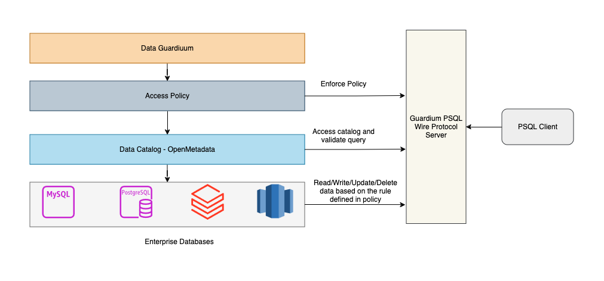

## Guardiuum Architecture

### Architecture Diagram

Guardium has 3 core components 
 - Data Catalog
 - Policy Management
 - Policy Enforcement

 #### Data Catalog

 For the purpose of data catalog, guardiuum uses Openmetadata underneath for the first phase. This can be extended to use other custom or open source data catalog tools as long as they support integrations via API to create and update datasource and fetch the catalog information.

 Guardiuum utilizes Openmetada's features such as adding new source, sync catalog information, column tagging & classification and Data Lineage(Upcoming release).

 #### Policy Management

 Users can define the roles and policies similar to apache ranger. Policies can be generic, fine-grained and hybrid. In generic case an Admin can enforce overall access/deny at the namespace level. In case of fine-grained, the admin can enforce the rule upto row or column level. In case of generic, the enforcement instructions can group all the columns based on tag and then apply the policy on these group of columns. The upcoming releases will see major improvements especially defining rules using NLU and auto applying of rules based on the rules already defined for other data sources and tags.

 #### Policy Enforcement

 Guardiuum does not make any changes to the underlying or source database. It provides a PSQL wire protocol compliant servers which will expose a Postgres database endpoint. Any queries directed towards this service will enforce the policies defined in the portal. There are key advantages with this approach compared to making changes to the underlying datasources.

 1. It is difficult to track the policy changes and identify which changes were applied by the governance tool or outside the tool. Overall change management across multiple data source will be difficult.
 2. Cannot manage datasource which doesn't support applying data policies natively. Ex: Internal ERP tool
 3. Single source of truth for all queries.
 4. Supports capturing data lineage across different sources without creating temporary data. It also avoids multiple stages in extracting the final meaningful data closer to the source.
 5. Supports Query Federation. Avoids data duplication for data enrichment across multiple data sources. For ex: if data needs to be joined across multiple table, enriched and then used in reporting tool. Since query federation is natively available, reporting tools can fetch any accessible data directly from Guardiuum.
 6. Can communicate with any enterprise data source using SQL query and enforce policies. Ex: Saleforce integration.
